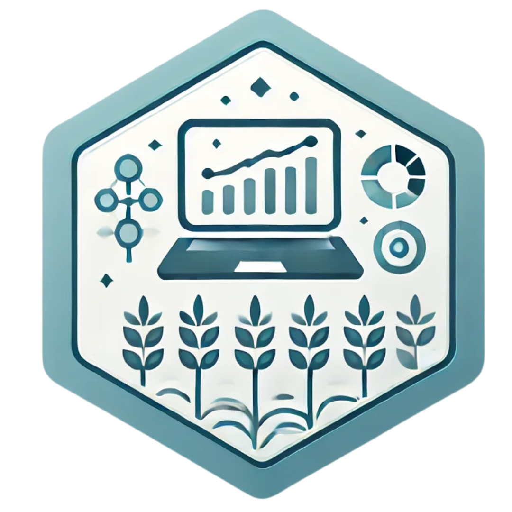

<!-- README.md is generated from README.Rmd. Please edit that file -->

```{r, include = FALSE}
knitr::opts_chunk$set(
  collapse = TRUE,
  comment = "#>",
  fig.path = "man/figures/README-",
  out.width = "100%"
)
```

# agrodata 

<!-- badges: start -->
[](https://lifecycle.r-lib.org/articles/stages.html#experimental)
<!-- badges: end -->

The goal of agrodata is to provide dataset examples for statistical analysis.

## Installation

You can install the development version of agrodata from [GitHub](https://github.com/) with:

``` r
# install.packages("pak")
pak::pak("NEPEM-UFSC/agrodata")
```

## Example


```{r example}
library(agrodata)
library(ggplot2)
df <- ad_normal()


ggplot(df, aes(length)) +
  geom_histogram(aes(y = after_stat(..density..)),
                 bins = 60) +
  labs(x = "Length of the grain (mm)",
       y = "Density",
       title = "Distribution of the length of 86,436 flax grains",
       subtitle = "The red line represents the theoretical normal distribution") +
  stat_function(fun = dnorm,
                geom = "line",
                col = "red",
                linewidth = 1,
                args = list(
                  mean = mean(df$length),
                  sd = sd(df$length)
                ))

```

